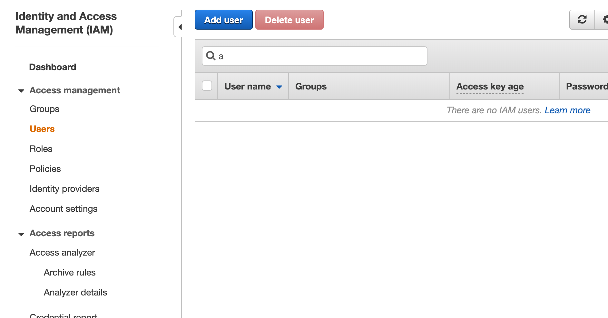

# AWSCodeDeploy : Code Pipeline을 활용한 배포 자동화
AWS deployment automation using pipeline
- https://docs.aws.amazon.com/ko_kr/codepipeline/latest/userguide/getting-started-codepipeline.html

## 1 IAM 사용자 생성
> Identity and Access Management (IAM) 
> Access management 
> Users
> Add user

> Policies 정책

> Create policy 
> Add 

## 2 IAM 관리형 정책을 사용해 IAM 사용자에게 CodePipeline 권한 할당

## 3 AWS CLI 설치

## 4 CodePipeline 콘솔 열기

