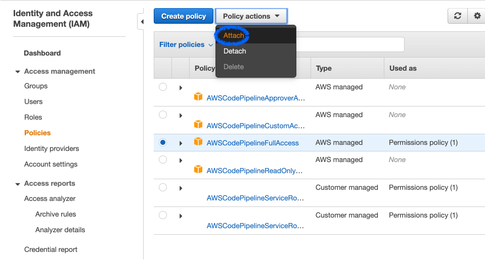
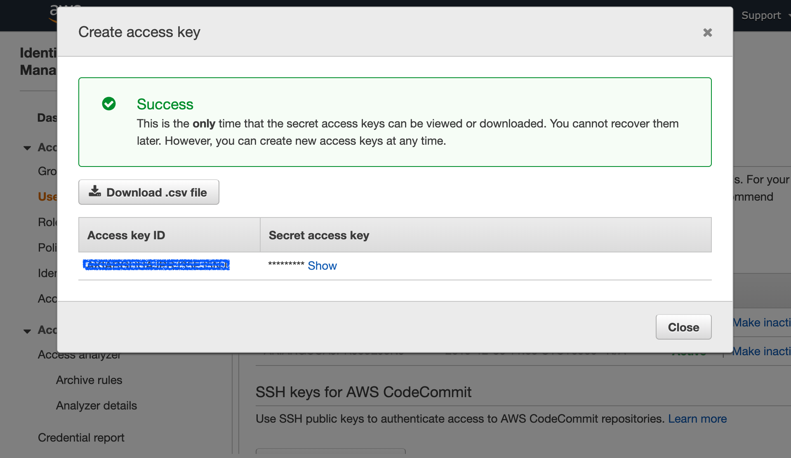
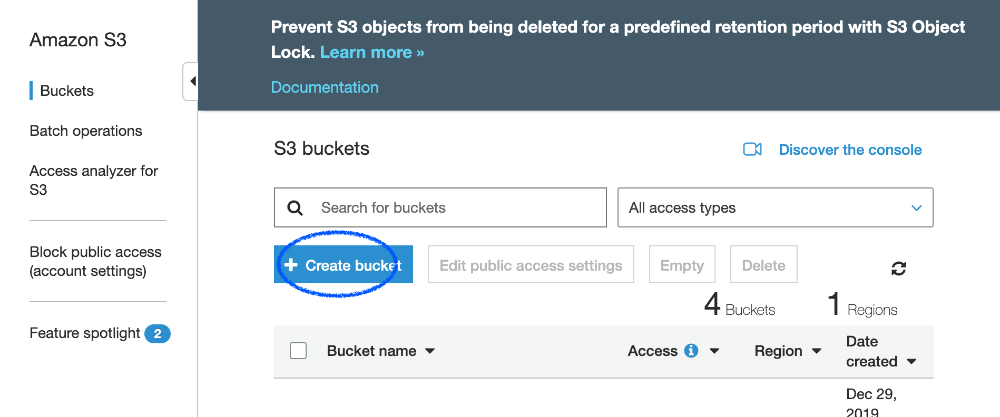
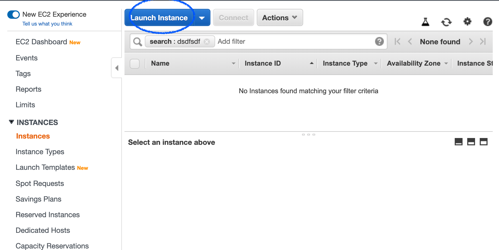
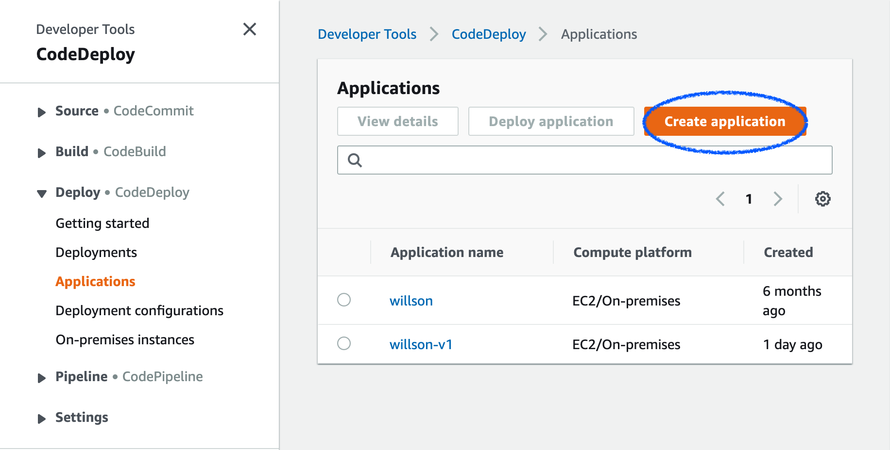
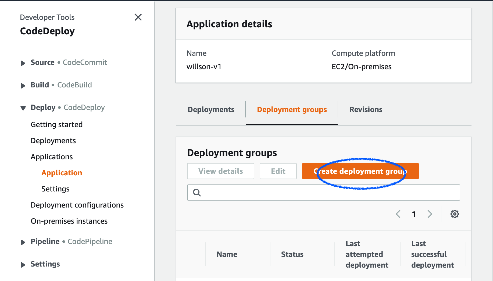
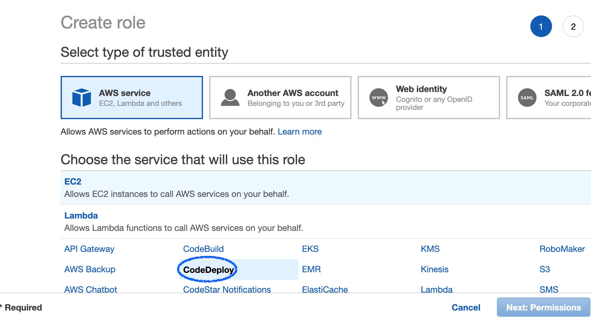
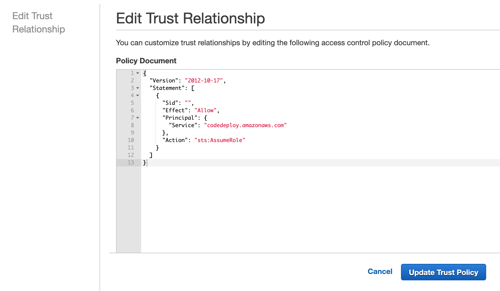
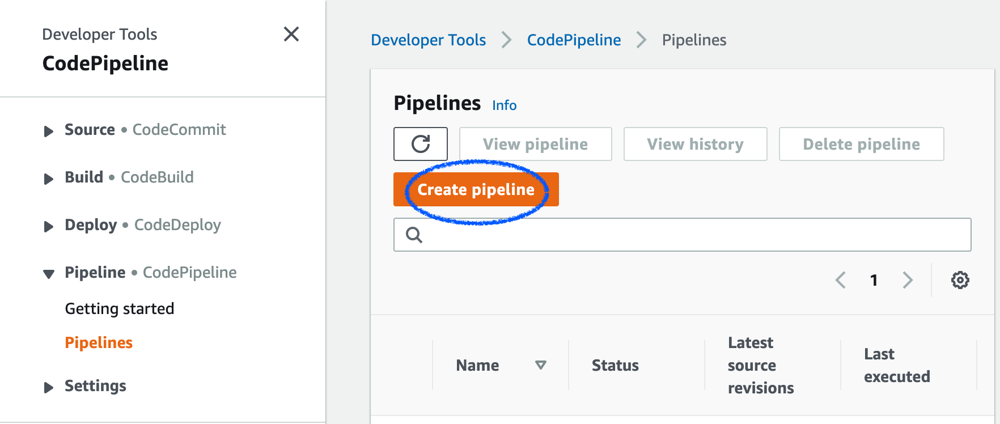

# AWSCodeDeploy : Code Pipeline을 활용한 배포 자동화
AWS deployment automation using pipeline
- https://docs.aws.amazon.com/ko_kr/codepipeline/latest/userguide/getting-started-codepipeline.html

## 1 IAM 사용자 생성
> Identity and Access Management (IAM)

> Access management 

> Users

> Add user

* User name
* Select Access Type
  * AWS Management Console access
* Permission
  * Add user to group (생성된 그룹이 없을 시 Create group)
* Tag (생략)
* Review
* Access key & scret access key

## 2 IAM 관리형 정책을 사용해 IAM 사용자에게 CodePipeline 권한 할당
> Identity and Access Management (IAM)

> Access management 

> Policies 정책

> AWS Management 콘솔을 사용해 IAM 사용자에게 권한을 부여
* 정책 목록에서 AWSCodePipelineFullAcess 관리형 정책 선택

* Policy action
* Attach : 정책을 부여할 유저 선택

## 3 AWS CLI 설치
> 로컬 환경에서 CodePipeline 명령 호출하기 위해 aws cli 설치

sudo pip install awscli
aws configure

AWS Access Key ID [None]: Type your target AWS access key ID here, and then press Enter
AWS Secret Access Key [None]: Type your target AWS secret access key here, and then press Enter
Default region name [None]: Type ap-northeast-2 here, and then press Enter
Default output format [None]: Type json here, and then press Enter
* access key ID & secret access key 확인 방법
 * IAM Users 선택
 * Summary > Security credentials
 

----
CodePipeline 생성

간단한 파이프라인 생성(Amazon S3 버킷) 
: CodeDeploy를 사용하여 Amazon S3 버킷의 샘플 애플리케이션을 Amazon Linux이 실행 중인 Amazon EC2 인스턴스에 배포하는 2단계 파이프라인을 생성

## 4 애플리케이션에 대한 Amazon S3 버킷 생성
> Amazon S3 콘솔

> Create bucket
 
* bucket name
* region
: Asia Pacific (Seoul)
* Versioning
: keep all versions of an object in the same bucket(객체의 모든 버전을 동일한 버킷에 보관) 체크
* Block public access 체크 해제
객체에 대한 계정 읽기/쓰기 액세스를 허용하는 기본 권한을 수락
* Create bucket
> GitHub 레포지토리 업로드
GitHub 리포지토리로부터 샘플을 다운로드

## 5 Amazon EC2 인스턴스 생성 및 CodeDeploy 에이전트 설치
> EC2 dashboard

> Launch Instance

* AMI 선택
: Ubuntu Server 16.04 LTS (HVM), SSD Volume Type
* Instance type 선택
: t2.micro
* Auto-assign Public IP
: enable
* IAM role
: CodeDeploy와 함께 사용할 IAM 인스턴스 프로파일로 사용되도록 구성된 IAM 역할을 선택
 * Amazon EC2 인스턴스에 대한 IAM 인스턴스 프로파일 만들기
 Policy 생성
  * Identity and Access Management (IAM)
  * Access management 
  * Policies 정책
  * Create Policy
  * JSON 탭 선택
  
  {
  
    "Version": "2012-10-17",
    
    "Statement": [
    
        {
        
            "Action": [
            
                "s3:Get*",
                
                "s3:List*"
                
            ],
            
            "Effect": "Allow",
            
            "Resource": "*"
            
        }
        
     ]
     
   }
   * Review Policy
   * Name
   : CodeDeployDemo-EC2-Permissions
   * Create Policy
  생성된 정책을 역할에 
   * Roles
   * Create Roles
   * Choose the service that will use this role
   : EC2
   * Attached permissions policy
   : CodeDeployDemo-EC2-Permissions
   * Add tags(생략)
   * Role name
   : CodeDeployDemo-EC2-Instance-Profile
   * Create Role
* User data 
: as text 선택

#!/bin/bash

apt-get -y update

apt-get -y install ruby

apt-get -y install wget

cd /home/ubuntu

wget https://aws-codedeploy-ap-northeast-2.s3.amazonaws.com/latest/install

chmod +x ./install

./install auto

* add storage 생략
* add tag
: Key = Name, Value = MyCodePipelineDemo
* Configure Security Group
: SSH, HTTP, HTTPS, MYSQL.. 등의 포트 허용
* Review Instance Launch

## 6 CodeDeploy에서 애플리케이션 생성
> 애플리케이션 생성

* Application name
: MyApplication
* Compute platform
: EC2/On-premises

> 배포 그룹 생성
create deployment group

* Deployment group name
: MyApplicationGroup
* Service role
: CodeDeployServiceRole 선택
 * AWSCodeDeployRole 콘솔에서 생성 방법
  * Create role
  * AWS service
  : CodeDeploy 선택
  
  * Select your use case
  : CodeDeploy(Allows CodeDeploy to call AWS services such as Auto Scaling on your behalf) 선택
  * Add tag (생략)
  * Role name
  : CodeDeployServiceRole
  * Create role
  * Trust relationships 탭 선택
  * Edit trust relationship
   
* Deployment type
: in-place
* Environment configuration
: Amazon EC2 instances
Key = Name, Value = MyCodePipelineDemo
* Deployment settings
: CodeDeployDefault.HalfAtATime
* Load balancer (생략)

## 7 CodePipeline에서 파이프라인 생성
  
  > Welcome > Getting started > Create new pipeline
  
  > Choose pipeline settings
  * Pipeline name
  :  MyPipeline
  * Service role
  : New Service role -> AWSCodePipelineServiceRole-region-pipeline_name
   ex) AWSCodePipelineServiceRole-ap-northeast-2-MyPipeline
  * Artifact store
  : Default location // Amazon S3 아티팩트 버킷과 같은 기본 아티팩트 스토어를 사용
  * Encryption key
  : Default AWS Managed Key
  
  > Add source stage
  * Source
  : Github
  * Connect to GitHub 
  : github 로그인 후 연동 과정
  * Repository
  : 아이디/레포지토리명
  * Branch
  : 브랜치 선택
  * Change detection options
  : Github webhooks // 깃헙 레포지토리의 변동 사항을 감지하여 자동으로 pipeline 동작
  
  > Add build stage (생략)
  
  > Add deploy stage
  * Deploy provider
  : AWS CodeDeploy
  * Region
  : Asia Pacific (Seoul)
  * Application Name
  : MyApplication
  * Deployment group
  : MyApplicationGroup
   
   
  
